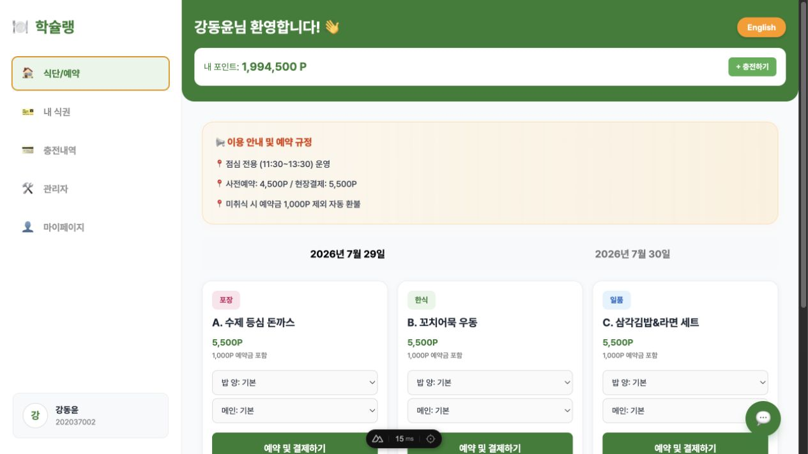
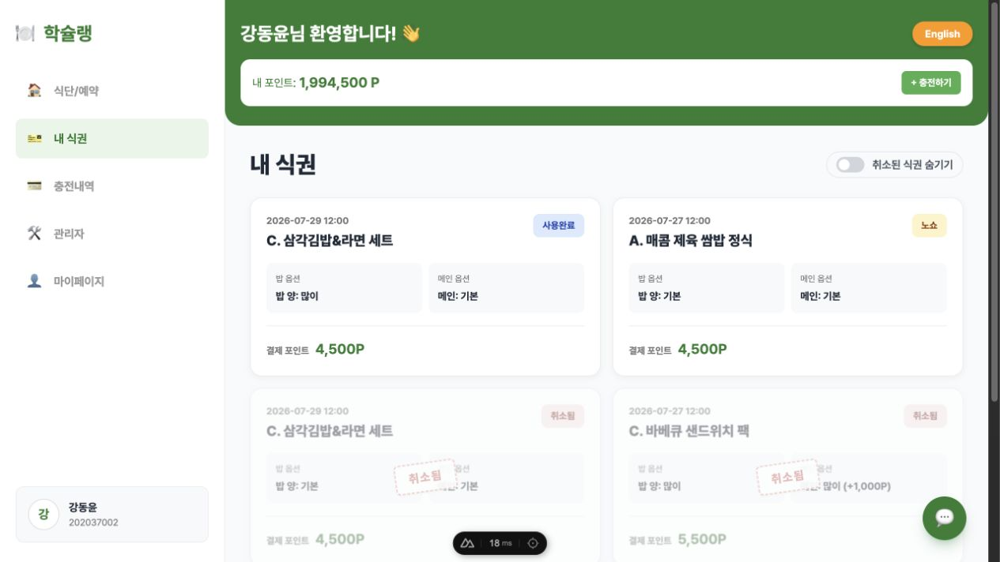
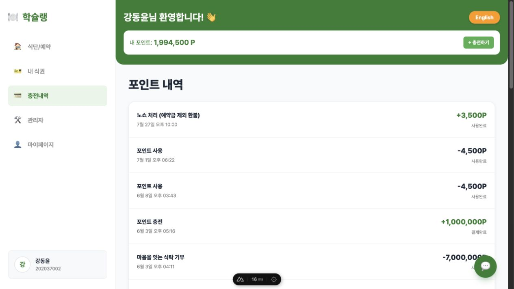
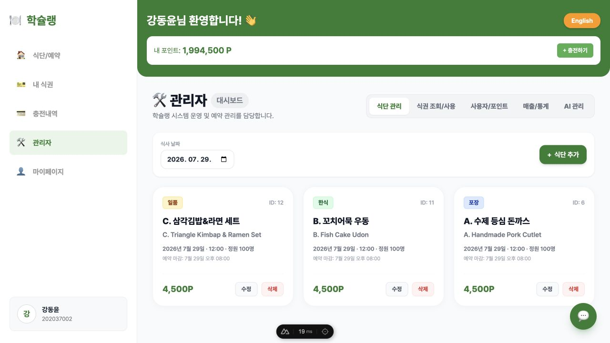
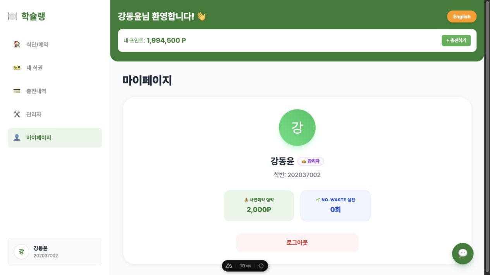
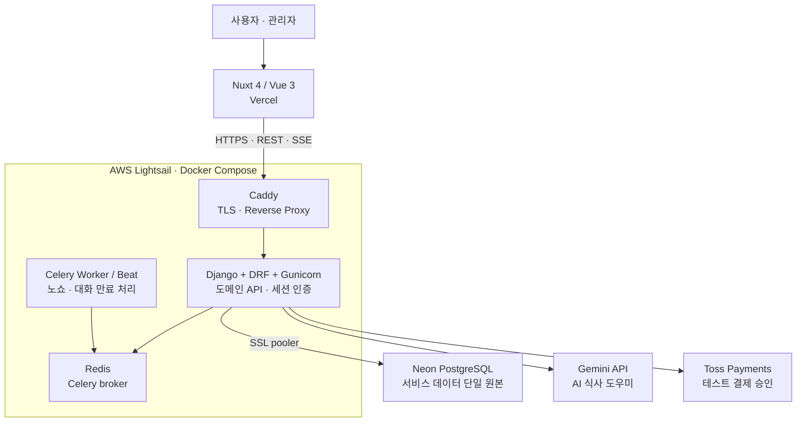
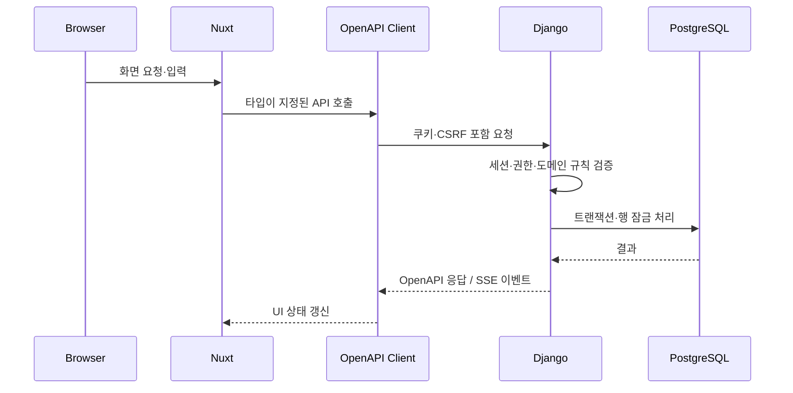
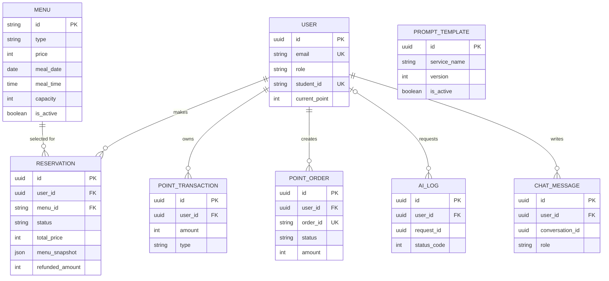

# 🍱 학슐랭 Hakchelin

> **대학생의 학식 예약부터 식권·포인트·운영 관리까지 연결한 스마트 학식 서비스**

[서비스 바로가기](https://hakchelin.cloud) · [API 문서](https://api.hakchelin.cloud/api/docs/) · [API 상태](https://api.hakchelin.cloud/healthz)

학슐랭은 날짜와 식사 시간별 메뉴를 보고 미리 예약한 뒤, 식권·포인트·결제 내역을 한곳에서 관리할 수 있는 웹 서비스입니다. 학생은 대기 시간을 줄이고, 운영자는 메뉴·예약 인원·노쇼·포인트를 관리합니다.

기존 BaaS 중심 구조를 **Nuxt/Vue 프런트엔드와 Django 도메인 API, Neon PostgreSQL**로 전환했습니다. 현재 인증, 예약, 포인트, 결제 승인, 챗봇, 정기 작업은 모두 Django와 Celery가 담당하며 Supabase 의존성은 제거했습니다.

## 배포 환경

| 구분 | 주소 | 역할 |
| --- | --- | --- |
| Web | [hakchelin.cloud](https://hakchelin.cloud) | Nuxt 4 / Vue 3 사용자·관리자 웹 |
| API | [api.hakchelin.cloud](https://api.hakchelin.cloud/healthz) | Django REST API, 세션 인증, SSE 챗봇 |
| API 문서 | [Swagger UI](https://api.hakchelin.cloud/api/docs/) | OpenAPI 계약 확인 |

## 핵심 기능

| 영역 | 기능 |
| --- | --- |
| 메뉴·예약 | 날짜·식사 시간별 메뉴 조회, 옵션 선택, 마감·정원·중복 식사 시간 검증 |
| 식권 | 예약 생성, 사용 처리, 취소, 노쇼 처리와 정책 기반 환불 |
| 포인트 | 충전 주문, 결제 승인, 사용·환불·기부, 거래 이력 조회 |
| 인증·권한 | 이메일 회원가입·로그인·로그아웃, Django 세션·CSRF, 학생/관리자 권한 분리 |
| 관리자 | 메뉴, 사용자 역할·포인트, 식권, 거래, AI 로그 관리 |
| AI 챗봇 | Gemini 기반 SSE 응답, 본인 메뉴·식권·포인트만 읽는 대화 문맥 |
| 다국어 | 한국어·영어 UI |

> Toss Payments는 포트폴리오 검증을 위한 **테스트 결제**만 사용합니다. 실제 결제 전환은 별도 사업·계약 준비가 필요합니다.

## 화면

### 메뉴 조회와 예약

<p align="center">
  
</p>

### 식권과 포인트 내역

<table>
  <tr>
    <td width="50%" align="center"><strong>식권 관리</strong></td>
    <td width="50%" align="center"><strong>포인트 내역</strong></td>
  </tr>
  <tr>
    <td></td>
    <td></td>
  </tr>
</table>

### 관리자와 인증

<table>
  <tr>
    <td width="50%" align="center"><strong>관리자 메뉴 관리</strong></td>
    <td width="50%" align="center"><strong>사용자 프로필</strong></td>
  </tr>
  <tr>
    <td></td>
    <td></td>
  </tr>
</table>

## 아키텍처



### 요청 흐름



## 핵심 ERD

서비스 데이터는 Neon PostgreSQL의 Django 모델로 관리합니다. 예약은 메뉴 스냅샷을 보존하고, 포인트 거래는 회계 이력으로 남기며, 사용자별 대화와 AI 로그는 별도로 분리합니다.



- 메뉴는 예약 이력을 보존하기 위해 삭제하지 않고 비활성화합니다.
- 활성 예약에는 사용자·식사 날짜·시간 기준의 조건부 유니크 제약을 적용해 중복 예약을 막습니다.
- `order_id`, `payment_key`는 결제 멱등성을 위해 유니크하게 관리합니다.
- AI 대화는 사용자·대화 ID 기준으로 격리하고 7일이 지난 메시지는 정리합니다.

전체 필드, 인덱스와 삭제 정책은 [Django ERD](./docs/django-erd.md)에서 확인할 수 있습니다.

## 기술 스택

| 영역 | 기술 | 선택 이유 |
| --- | --- | --- |
| Frontend | Nuxt 4, Vue 3, TypeScript | SSR·라우팅·반응형 UI를 갖춘 Vue 기반 웹 |
| UI / i18n | Tailwind CSS, Nuxt i18n | 빠른 UI 구성과 한국어·영어 전환 |
| Backend | Python 3.13, Django 5, Django REST Framework | 인증·관리자·도메인 규칙을 한 서버에서 일관되게 처리 |
| API 계약 | drf-spectacular, OpenAPI, openapi-fetch | 백엔드 스키마에서 TypeScript 클라이언트를 생성 |
| Database | Neon PostgreSQL | 관계형 데이터, 트랜잭션, 행 잠금, 관리형 Postgres |
| 비동기 작업 | Celery, Redis | 노쇼 정산과 7일 경과 대화 삭제를 API 요청과 분리 |
| AI / 결제 | Gemini API, Toss Payments | 사용자별 읽기 전용 안내와 서버 측 결제 승인 |
| 인프라 | Docker Compose, Caddy, AWS Lightsail | 소규모 서비스에 맞는 TLS·리버스 프록시·컨테이너 운영 |
| 배포·검증 | GitHub Actions, GHCR, Vercel | CI 검증, 불변 SHA 이미지, 프런트 자동 배포 |

## 프로젝트 구조

```text
Hakchelin/
├── frontend/                 # Nuxt 4 / Vue 3 사용자·관리자 웹
├── backend/                  # Django / DRF / Celery 도메인 API
│   ├── accounts/             # 사용자·인증·역할
│   ├── meals/                # 메뉴
│   ├── reservations/         # 예약·취소·노쇼
│   ├── wallet/               # 포인트·거래·기부
│   ├── payments/             # Toss 주문·승인
│   └── chatbot/              # Gemini·대화·AI 로그
├── packages/api-client/      # OpenAPI 생성 TypeScript 클라이언트
├── infra/lightsail/          # Compose, Caddy, systemd, 배포·백업 스크립트
├── docs/                     # ERD, 구현 일지, 런북, 트러블슈팅
└── .github/workflows/        # CI와 외부 health check
```

## 로컬 실행

### 사전 요구 사항

- Node.js 22 이상
- pnpm 10
- Python 3.13 이상과 [uv](https://docs.astral.sh/uv/)
- Docker Desktop — PostgreSQL 동시성 테스트 또는 운영 유사 환경에서 사용

### 1. 환경 변수 준비

```bash
pnpm install
cp backend/.env.example backend/.env
uv --directory backend sync --all-groups
```

`backend/.env`에서 필요한 값만 설정합니다. 비밀값은 커밋하지 않습니다.

| 변수 | 로컬 기본값 / 용도 |
| --- | --- |
| `DATABASE_URL` | 비우면 SQLite 사용, Neon 사용 시 SSL pooler URL |
| `DJANGO_SECRET_KEY` | Django 세션 서명 키 |
| `TOSS_PAYMENTS_SECRET_KEY` | Toss 테스트 결제 승인에 필요 |
| `GEMINI_API_KEY` | 실제 Gemini 응답에 필요. 없으면 안전한 fallback 응답 |

Nuxt API 주소는 기본적으로 `http://localhost:8000`입니다. 다른 API 주소를 쓸 때만 프런트엔드 실행 환경에 설정합니다.

```bash
NUXT_PUBLIC_API_BASE_URL=https://api.example.com pnpm dev:web
```

### 2. Django API 실행

```bash
uv --directory backend run python manage.py migrate
uv --directory backend run python manage.py runserver
```

API는 `http://localhost:8000`, Swagger UI는 `http://localhost:8000/api/docs/`에서 확인할 수 있습니다.

### 3. Nuxt 웹 실행

새 터미널에서 실행합니다.

```bash
pnpm dev:web
```

웹은 기본적으로 `http://localhost:3000`에서 실행됩니다.

## 검증 명령

```bash
# OpenAPI 타입 생성과 최신성 확인
UV_CACHE_DIR=/tmp/hakchelin-uv-cache pnpm generate:api-client
git diff --exit-code -- packages/api-client/src/schema.d.ts

# Frontend
pnpm typecheck:web
pnpm build:web

# Backend
UV_CACHE_DIR=/tmp/hakchelin-uv-cache uv --directory backend run ruff check .
UV_CACHE_DIR=/tmp/hakchelin-uv-cache uv --directory backend run pytest
UV_CACHE_DIR=/tmp/hakchelin-uv-cache uv --directory backend run python manage.py makemigrations --check --dry-run

# Supabase 같은 레거시 런타임 의존성 재유입 방지
scripts/check-runtime-boundaries.sh
```

PostgreSQL 동시성 테스트는 `TEST_DATABASE_URL`을 PostgreSQL로 지정하거나 CI와 같은 일회용 PostgreSQL 컨테이너에서 실행합니다.

## CI·운영

- Pull request: API contract 최신성, API client·Nuxt 타입 검사, 프로덕션 빌드, Django 테스트와 PostgreSQL 동시성 테스트
- `main`: CI 통과 후 Linux amd64 Docker 이미지를 GHCR에 발행하고 provenance를 기록
- Lightsail: 5분 주기의 systemd timer가 검증된 SHA image를 배포하고 외부 health를 확인
- 모니터링: GitHub Actions가 15분마다 Web·API·`www` canonical redirect를 외부에서 확인
- 백업: Neon 논리 백업과 격리 복원 리허설 스크립트를 제공. 운영 시에는 정기 실행과 외부 암호화 저장소 보관을 권장

## 문서

| 문서 | 내용 |
| --- | --- |
| [Django ERD](./docs/django-erd.md) | 최종 도메인 모델, 제약 조건, 데이터 보존 정책 |
| [마이그레이션 계획](./docs/django-migration-plan.md) | 전환 목표와 완료 기준 |
| [트러블슈팅 일지](./docs/troubleshooting/django-migration.md) | 인증·결제·챗봇·배포에서 겪은 문제와 해결 |
| [운영 모니터링 런북](./docs/runbooks/operations-monitoring.md) | health check, 장애 분류, 초동 대응 |
| [자동 배포 런북](./docs/runbooks/automated-deployment.md) | GHCR 이미지, Lightsail 배포와 롤백 |
| [Neon 백업·복원 런북](./docs/runbooks/neon-backup-restore.md) | 논리 백업과 격리 복원 절차 |
