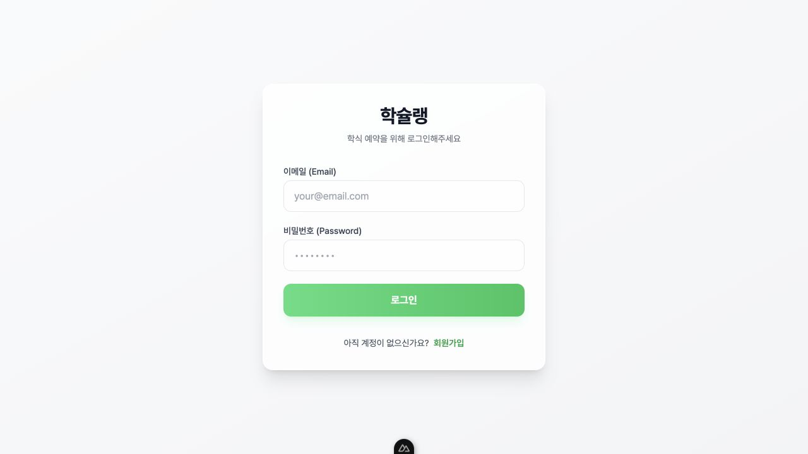
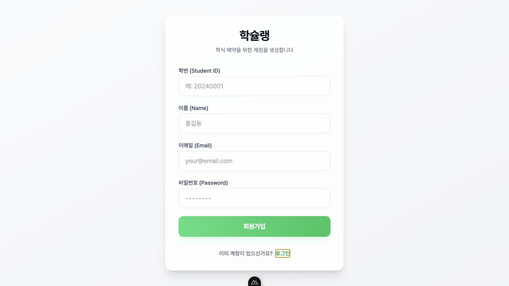
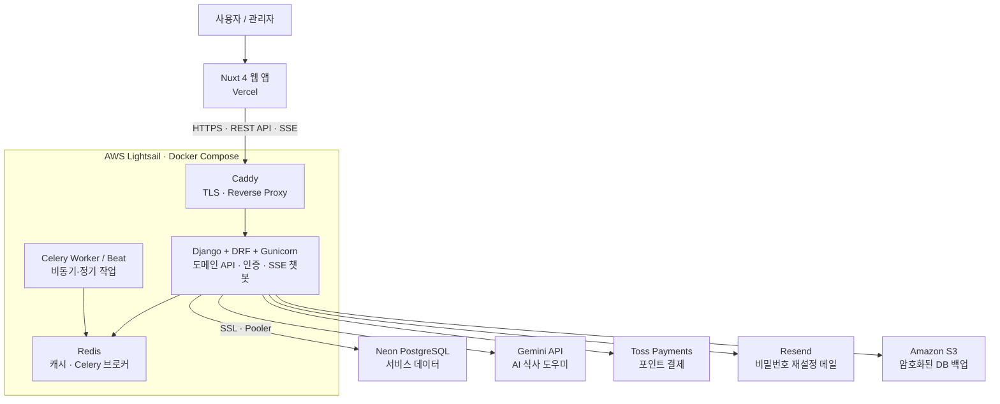

# 🍱 학슐랭 Hakchelin

> 대학생의 학식 예약, 식권 관리, 포인트 결제, 운영 관리를 하나로 연결하는 스마트 학식 서비스

학슐랭은 학식 메뉴를 날짜별로 확인하고, 예약부터 취소·식권 확인·포인트 결제까지 처리할 수 있는 웹 서비스입니다. 학생에게는 대기 시간을 줄인 식사 경험을, 운영자에게는 메뉴·예약 인원·노쇼를 관리할 수 있는 도구를 제공합니다.

로컬 런타임은 Supabase 직접 호출을 제거하고 **Django API 기반의 분리형 모노레포**로 전환했습니다. 운영 데이터의 Neon 이관과 인프라 컷오버는 다음 단계에서 진행합니다.

## 주요 기능

- 날짜와 식사 시간별 학식 메뉴 조회 및 사전 예약
- 예약 마감·정원·중복 예약을 서버에서 검증하는 식권 발급
- 예약 취소 및 정책에 따른 환불 처리
- 포인트 충전, 결제, 기부와 거래 이력 조회
- 메뉴·사용자·식권·노쇼·포인트를 관리하는 관리자 화면
- 한국어/영어 다국어 UI
- 메뉴·내 식권·내 포인트를 읽기 전용으로 안내하는 Gemini 기반 AI 식사 도우미

## 화면

### 메뉴 조회 및 예약

<p align="center">
  
</p>

### 내 식권 및 포인트 내역

<table>
  <tr>
    <td width="50%" align="center"><strong>식권 관리</strong></td>
    <td width="50%" align="center"><strong>포인트 내역</strong></td>
  </tr>
  <tr>
    <td></td>
    <td></td>
  </tr>
</table>

### 관리자 식단 관리

<p align="center">
  
</p>

### 마이페이지 및 인증

<p align="center">
  
</p>

<table>
  <tr>
    <td width="50%" align="center"><strong>로그인</strong></td>
    <td width="50%" align="center"><strong>회원가입</strong></td>
  </tr>
  <tr>
    <td></td>
    <td></td>
  </tr>
</table>

## 아키텍처



## 기술 스택

| 영역 | 기술 | 역할 |
| --- | --- | --- |
| Frontend | Nuxt 4, Vue 3, TypeScript | 반응형 사용자·관리자 웹 UI |
| UI / i18n | Tailwind CSS, Nuxt i18n | 일관된 UI와 한국어·영어 지원 |
| Backend | Python, Django, Django REST Framework | 도메인 규칙, REST API, 인증, 관리자 기능 |
| API Contract | drf-spectacular, OpenAPI, openapi-fetch | API 명세 기반 타입 안전 클라이언트 |
| Database | PostgreSQL on Neon | 관계형 서비스 데이터와 분리된 DB 운영 |
| Background Jobs | Celery, Redis | 노쇼 정산, 이메일, 정기 작업 |
| AI | Gemini API | 사용자별 데이터로 제한된 읽기 전용 식사 도우미 |
| Payments | Toss Payments | 포인트 충전 결제 승인 |
| Infrastructure | Docker, Docker Compose, Caddy, AWS Lightsail | 컨테이너 배포, TLS, 리버스 프록시 |
| CI/CD | GitHub Actions, Vercel | 테스트, 빌드, 프런트엔드 자동 배포 |
| Backup / Email | Amazon S3, Resend | DB 백업과 비밀번호 재설정 메일 |

## 목표 모노레포 구조

```text
frontend/                # Nuxt 프런트엔드
backend/                 # Django + DRF + Celery
packages/
  api-client/           # OpenAPI 기반 TypeScript 클라이언트
infra/
  lightsail/            # Docker Compose, Caddy, 배포 설정
docs/
  django-migration-plan.md
  django-migration-implementation-journal.md
  troubleshooting/django-migration.md
```

## 로컬 실행

```bash
pnpm install
cp backend/.env.example backend/.env
uv --directory backend sync --all-groups
uv --directory backend run python manage.py migrate
uv --directory backend run python manage.py runserver
```

다른 터미널에서 프런트엔드를 실행합니다.

```bash
pnpm dev:web
```

Nuxt는 기본적으로 `http://localhost:8000`의 Django API에 연결합니다. 다른 주소를 사용할 때는 `NUXT_PUBLIC_API_BASE_URL`을 설정합니다. SQLite는 `DATABASE_URL`을 비워 두면 사용하며, 실제 결제·AI 응답에는 각각 `TOSS_PAYMENTS_SECRET_KEY`, `GEMINI_API_KEY`가 필요합니다.

현재 환경 변수는 로컬 `.env`에만 설정하고 저장소에 커밋하지 않습니다.
