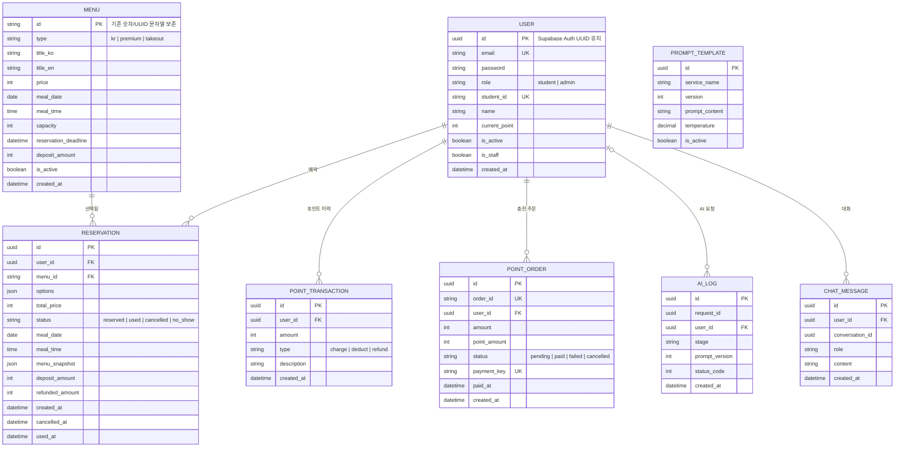

# Django 대상 데이터 모델

이 문서는 Supabase의 최종 스키마를 보존하면서 Neon으로 이전할 Django 도메인 모델을 정의한다. 브리지 기간에는 이 모델의 migration을 Supabase에 적용하지 않는다.

## 이관과 삭제 정책

- `User.id`는 Supabase Auth UUID를 보존하고, 이메일은 Auth 사용자 데이터에서 이관한다. 기존 비밀번호는 이관하지 않고 unusable password로 생성한다.
- `Menu.id`는 초기 데모 데이터의 숫자 문자열을 포함하므로 문자열 기본키를 유지한다.
- `Reservation`은 메뉴 스냅샷을 보존한다. 예약이 있는 메뉴는 삭제하지 않고 `is_active=false`로 비활성화하며 DB는 `PROTECT`로 삭제를 막는다.
- 사용자 계정은 삭제하지 않고 `is_active=false`로 비활성화한다. 이로써 예약·결제 이력을 보존한다.
- `PointTransaction`은 기존 스키마와의 호환을 위해 예약·주문 직접 FK를 두지 않는다.
- 활성 프롬프트는 서비스별 하나만 허용하고, 사용자별 대화는 7일 뒤 정리한다.

## 핵심 인덱스와 제약 조건

- 활성 메뉴: `(meal_date, meal_time)` 부분 인덱스
- 예약: `(menu, status)` 인덱스와 활성 예약의 `(user, meal_date, meal_time)` 조건부 유니크 제약
- 주문: `order_id`, `payment_key` 유니크 제약
- 프롬프트: `(service_name, version)` 유니크 및 서비스별 활성 버전 조건부 유니크 제약
- AI 로그: `(user, stage, created_at DESC)`, `(created_at DESC)` 인덱스
- 채팅: `(user, conversation_id, created_at)` 인덱스
