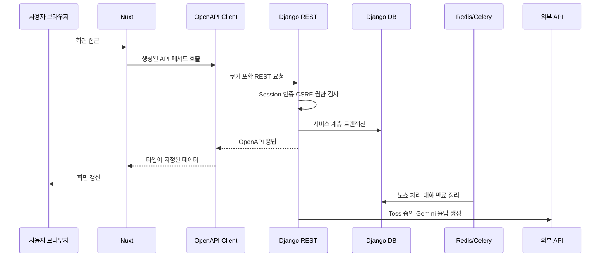

# Django 마이그레이션 구현 일지

> 기록 범위: 모노레포 기반 구축부터 로컬 Django REST 컷오버까지
>
> 현재 상태: Neon 스테이징 ETL·대조 완료, Lightsail 운영 배포 준비 중

이 문서는 학슐랭을 Nuxt·Supabase 구조에서 Nuxt·Django 구조로 옮기며 실제로 구현한 내용과 검증 결과를 시간순으로 정리한다. 문제의 증상·원인·해결 과정은 [Django 마이그레이션 트러블슈팅 일지](./troubleshooting/django-migration.md)에 별도로 기록한다.

## 1. 작업 흐름과 PR

| 단계 | PR | 주요 결과 |
| --- | --- | --- |
| 모노레포 기반 | [#1](https://github.com/kangdy25/Hakchelin/pull/1) | Nuxt를 `frontend/`로 이동하고 Django·DRF·Celery·Redis·Caddy·CI 기반 구축 |
| Supabase 읽기 브리지 | [#2](https://github.com/kangdy25/Hakchelin/pull/2) | Supabase JWT 검증, legacy 읽기 adapter, 초기 OpenAPI 계약 구현 |
| Django 쓰기 서비스 | [#3](https://github.com/kangdy25/Hakchelin/pull/3) | 예약·취소·포인트·결제 서비스 계층과 트랜잭션 테스트 구현 |
| 트러블슈팅 문서화 | [#4](https://github.com/kangdy25/Hakchelin/pull/4) | 1~3단계의 빌드·인증·트랜잭션 문제 기록 |
| 프런트 읽기 연동 | [#5](https://github.com/kangdy25/Hakchelin/pull/5) | 메뉴·프로필·예약·거래 이력을 Django 생성 클라이언트로 우선 전환 |
| 로컬 Django REST 컷오버 | [#6](https://github.com/kangdy25/Hakchelin/pull/6) | 인증·읽기·쓰기·관리자·결제·챗봇·정기 작업을 Django로 전환하고 프런트 Supabase 런타임 제거 |
| Neon 컷오버 기반 | 진행 중 | Neon 스키마, 멱등 ETL, 자동 대조, 쓰기 차단, PostgreSQL 동시성 검증 구현 |

각 단계는 `codex/` 브랜치에서 한국어 Conventional Commit으로 작업했고, CI 통과 후 merge commit으로 병합했다.

## 2. 최종 로컬 요청 흐름

Nuxt 화면은 Django 내부 모델이나 데이터베이스를 알지 않는다. `useApi`가 UI 호환 타입을 유지하고, 실제 HTTP 요청은 `packages/api-client`의 생성 계약을 사용한다.

## 3. 백엔드 구현

### 인증과 권한

- CSRF 쿠키 발급, 이메일·비밀번호 회원가입, 로그인, 로그아웃, 현재 사용자 API를 구현했다.
- 인증 상태는 Django `sessionid` HttpOnly 쿠키로 유지한다.
- 현재 로컬 계약에는 access/refresh 토큰과 토큰 갱신 API가 없다. 운영 인증 방식을 확정할 때 세션 유지 여부를 결정하고, 토큰 방식을 선택하는 경우에만 Secure·HttpOnly access/refresh 쿠키와 갱신 API를 후속 구현한다.
- 모든 변경 요청은 `csrftoken`과 `X-CSRFToken`을 대조한다.
- 관리자 API는 사용자 `role`이 `admin`인지 서버에서 검사한다.
- 사용자 예약·거래·대화 조회는 항상 `request.user`로 범위를 제한한다.

### 메뉴와 예약

- 메뉴 공개 조회와 관리자 생성·수정·비활성화 API를 구현했다.
- 메뉴는 예약 이력을 보존하기 위해 삭제 대신 비활성화한다.
- 예약 시 가격·옵션·마감 시간·정원·동일 식사 시간 중복·포인트 잔액을 서버에서 검증한다.
- 예약 생성, 포인트 차감, 거래 이력 생성을 하나의 DB 트랜잭션으로 처리한다.
- 사용자 취소는 마감 시간에 따라 전액 또는 예약금 제외 환불을 적용한다.
- 관리자는 식권 사용과 전액 환불 취소를 처리할 수 있다.

### 포인트와 Toss 결제

- 포인트 기부, 관리자 포인트 조정, 충전 주문 생성과 승인 API를 구현했다.
- 충전 주문의 사용자 소유권과 승인 금액을 Toss 호출 전에 검증한다.
- Django 서버가 비밀 키로 Toss Payments 승인 API를 호출하므로 브라우저 응답만으로 포인트를 적립하지 않는다.
- 주문 ID를 Toss 멱등성 키로 사용하고 이미 승인된 주문은 포인트 거래를 다시 만들지 않는다.

### 챗봇과 백그라운드 작업

- 기존 `token`, `done`, `error` SSE 이벤트 계약을 유지했다.
- Gemini에는 현재 사용자의 포인트·예정 메뉴·최근 식권만 문맥으로 제공한다.
- 대화 이력과 AI 성공·실패 로그를 Django 모델에 저장한다.
- API 키가 없는 로컬 환경에서는 Django 연결 상태를 알려주는 안전한 fallback 응답을 사용한다.
- Celery Beat가 15분마다 노쇼를 처리하고, 1시간마다 7일이 지난 대화를 삭제한다.
- 노쇼는 식사 종료 1시간 뒤 예약금만 유지하고 나머지 금액을 거래 이력과 함께 환불한다.

## 4. 프런트엔드 구현

- `useAuth`를 Supabase Auth에서 Django 세션 인증으로 교체했다.
- `useDjangoApi`가 SSR 요청 쿠키 전달, 브라우저 credential, CSRF 헤더를 담당한다.
- 메뉴·예약·포인트·거래·사용자·관리자·챗봇 호출을 Django `/api/`로 전환했다.
- SSE만 API 클라이언트 패키지의 전용 streaming 함수로 처리한다.
- `@nuxtjs/supabase`, Supabase CLI 패키지, 생성 DB 타입 파일을 제거했다.
- 프런트와 lockfile에서 `.from()`, `.rpc()`, Edge Function 호출을 제거했다.
- 개발 환경의 기본 API 주소를 `http://localhost:8000`으로 설정했다.

## 5. API 계약과 CI

- Django가 `/api/schema/`에서 OpenAPI 문서를 생성한다.
- 초기에는 호환되지 않는 API를 병행할 가능성에 대비해 `v1` 경로 접두사를 사용했지만, 현재는 외부 공개 소비자 없이 Nuxt와 Django를 함께 배포한다. 사용하지 않는 버전 계층을 유지하지 않기 위해 `/api/`로 단순화했고, 향후 독립 소비자나 장기 호환 요구가 생길 때 버전 정책을 다시 도입한다.
- 요청과 응답 serializer를 분리해 읽기 전용 필드가 쓰기 타입에 섞이지 않도록 했다.
- OpenAPI는 실행 중인 서버가 아닌 Django management command에서 생성한다.
- 생성된 TypeScript 타입은 `packages/api-client/src/schema.d.ts`에 커밋한다.
- CI는 다음 항목을 검사한다.

| 영역 | 검사 |
| --- | --- |
| Backend | Ruff, migration drift, Django 테스트 |
| API contract | OpenAPI 재생성 후 Git diff, API client 타입 검사 |
| Frontend | Nuxt 타입 검사, 프로덕션 빌드 |
| Preview | Vercel Preview 배포 |

## 6. 검증 결과

로컬 컷오버 PR에서 다음 결과를 확인했다.

- Django 테스트 12개 통과
- 로그인 CSRF 강제와 세션 쿠키 발급 검증
- 사용자별 예약·대화 격리와 관리자 권한 검증
- 예약·취소 잔액 및 거래 이력 원자성 검증
- Toss 승인 중복 요청의 멱등성 검증
- 노쇼 예약금 제외 환불 검증
- SSE `token → done` 순서와 대화 저장 검증
- 7일 경과 대화 삭제 검증
- OpenAPI 생성과 TypeScript API client 타입 검사 통과
- Nuxt 타입 검사와 프로덕션 빌드 통과
- Lightsail용 Django Docker 이미지 빌드 통과
- 실제 브라우저에서 회원가입 → 로그인 → SSR 프로필 → 메뉴·예약 조회 → 로그아웃 성공

## 7. 주요 트러블슈팅 요약

| 문제 | 원인 | 해결 |
| --- | --- | --- |
| 모노레포 전환 후 Vercel 빌드 실패 | Root Directory가 저장소 루트 | Vercel Root Directory를 `frontend`로 변경 |
| CI에서만 Nuxt 타입 검사 실패 | TypeScript·vue-tsc 버전이 직접 고정되지 않음 | 프런트 개발 의존성과 lockfile 고정 |
| 최종 URL 전환 후 legacy 테스트 실패 | 테스트가 Supabase adapter 구현에 결합 | 세션·권한·도메인 HTTP 계약 테스트로 교체 |
| 생성 클라이언트 요청 타입 오류 | APIView serializer 추론 실패와 읽기·쓰기 serializer 혼용 | `extend_schema`와 전용 write serializer 적용 |
| 로그인 다음 POST가 403 | 로그인 과정에서 CSRF 토큰 회전 | mutation마다 최신 CSRF 쿠키를 헤더에 반영 |
| 예약 API에서 500 | `request.user`가 `SimpleLazyObject` | 서비스에서 `get_user_model()`로 잠금 조회 |
| 브라우저에서 `Failed to fetch` | `localhost`와 `127.0.0.1` origin 혼용 | 개발 host 통일, 양쪽 CORS·CSRF origin 명시 |
| 결제·노쇼 책임 공백 | Edge Function·pg_cron 제거 후 대체 경로 필요 | Toss gateway와 Celery Beat 작업 구현 |

자세한 진단 과정과 배운 점은 [트러블슈팅 일지](./troubleshooting/django-migration.md)를 참고한다.

## 8. 아직 남은 작업

로컬 API 전환은 완료됐지만 운영 마이그레이션은 아직 끝나지 않았다.

1. 운영 도메인에서 Secure 쿠키, CORS, CSRF, Caddy TLS를 검증한다.
2. 실제 Toss·Gemini staging 키로 승인 실패·타임아웃·SSE 오류 경로를 검증한다.
3. DB 백업 생성과 복원 리허설 뒤 운영 컷오버를 진행한다.

기존 Supabase 계정은 이관 시 UUID와 프로필을 보존하되 **unusable password 상태로 유지**한다. 서비스 전환 안내나 비밀번호 재설정 메일은 보내지 않으며, 이후 실제 사용이 필요한 계정은 Django 회원가입으로 새로 만든다.

Supabase SQL과 Edge Function 파일은 이 단계가 끝날 때까지 ETL 원본과 복구 대조 자료로 보존한다.

## 9. 4단계 — Neon 컷오버 기반 구현

Supabase Auth와 public 스키마를 함께 읽는 `migrate_supabase_data` 명령을 추가했다. 이메일은 `auth.users`, 역할·학번·이름·포인트는 `public.users`에서 결합하며 프로필이 없는 이메일 계정, Auth 원본이 없는 프로필, 이메일 없는 프로필이 발견되면 이관을 시작하지 않는다.

ETL은 사용자→메뉴→예약→거래·주문→AI 데이터 순으로 실행한다. 원본 UUID와 문자열 메뉴 PK, 생성·수정 시각을 보존하고, null을 허용했던 legacy 설명·JSON 필드는 Django 모델의 기본값에 맞게 정규화한다. 최초 이관 계정만 unusable password로 만들고 재실행 시 이미 설정된 Django 비밀번호는 유지한다.

`verify_supabase_migration`은 다음 결과를 자동 대조한다.

- 8개 도메인 모델의 레코드 수와 PK 집합
- 사용자별 포인트와 전체 포인트 합계
- 예약·충전 주문 상태별 수량
- 정원·중복 식사·결제 멱등성·AI 조회에 필요한 인덱스와 제약 조건

점검 창에는 `DJANGO_WRITE_BLOCKED=true`로 `/api/` 상태 변경 요청을 503으로 차단한다. 읽기와 health check는 유지되므로 사용자 안내 화면과 운영 관측은 계속 가능하다.

GitHub Actions의 backend job에는 PostgreSQL 17 서비스를 추가했다. SQLite 테스트는 빠른 기본 검증으로 남기고, CI에서는 실제 PostgreSQL의 `select_for_update`를 사용해 정원 1개에 대한 동시 예약 두 건 중 한 건만 성공하는지, 동일 주문 동시 승인에서도 충전 거래가 한 건만 생기는지를 확인한다. 로컬 임시 PostgreSQL 17에서도 전체 20개 테스트가 통과했다.

Neon 스테이징에는 Django migration 전체를 적용했고 실제 생성된 인덱스·제약 조건이 자동 대조 목록과 일치함을 확인했다. Supabase Session pooler를 통한 dry-run에서는 사용자 22, 메뉴 17, 예약 32, 거래 93, 주문 52, 프롬프트 3, AI 로그 61, 대화 22건 등 총 302건이 유효성·외래키·대상 제약을 통과했으며 대상 쓰기는 모두 롤백됐다.

이후 같은 원본으로 실제 스테이징 ETL을 실행했고 명령 내부 자동 대조와 별도 `verify_supabase_migration` 재검증이 모두 `ok: true`를 반환했다. 8개 테이블의 누락·추가 PK는 0건이었고 사용자 포인트 총합은 원본·대상 모두 2,246,000점이었다. 예약 상태는 노쇼 17·사용 3·취소 12건, 충전 주문은 대기 43·결제 완료 9건으로 일치했으며 필수 인덱스와 unique 제약도 모두 확인했다.

## 10. 5단계 — 운영 배포 기반

Lightsail Seoul 인스턴스와 Static IP를 준비했다. API는 `api.hakchelin.cloud`에서 Caddy TLS 뒤에 실행하고, Nuxt는 Vercel의 `hakchelin.cloud`에서 제공하는 분리 구조로 확정했다. Django는 `sessionid`를 API host-only Secure·HttpOnly 쿠키로 유지하며, Nuxt가 CSRF 토큰을 mutation 헤더에 담을 수 있도록 `csrftoken`만 `.hakchelin.cloud` 범위로 설정한다.

Compose에는 일회성 `migrate` 서비스를 추가했다. API·Celery worker·beat가 migration 성공을 의존하므로, 컨테이너가 동시에 기동하면서 DB schema가 준비되기 전에 요청을 처리하는 문제를 피한다. HTTPS redirect와 HSTS는 로컬 기본값에 섞지 않고 운영 환경 파일에서만 명시적으로 활성화한다. 실제 서버 명령, 환경 변수와 롤백 원칙은 [Lightsail 운영 배포 런북](./runbooks/lightsail-deployment.md)에 기록했다.

첫 운영 기동에서는 API health check가 내부 `localhost`와 HTTP로 요청하는 반면, Django 운영 설정은 `api.hakchelin.cloud`만 허용하고 HTTPS redirect를 강제해 컨테이너가 unhealthy가 됐다. health check가 운영 `Host`와 `X-Forwarded-Proto: https` 헤더를 보내도록 수정해 외부 요청과 동일한 프록시 조건을 재현했다. 실제 배포에서는 Caddy가 Let's Encrypt 인증서를 발급했고 `https://api.hakchelin.cloud/healthz`가 `{"status": "ok"}`를 반환했다.

운영 챗봇의 첫 요청은 Gemini API에서 `gemini-2.5-flash` 모델이 신규 사용자에게 더 이상 제공되지 않는다는 502 로그를 남겼다. 기본 모델과 서버 환경 예시를 `gemini-3.6-flash`로 교체하고, 최신 모델군에서 deprecate된 `temperature` 요청 파라미터를 제거했다. 모델명과 요청 payload를 검증하는 회귀 테스트를 추가해 이후 기본값 회귀를 방지한다.

`gemini-3.6-flash` 전환 뒤 두 번째 요청이 20초 read timeout에 걸리는 사례도 확인했다. 요청 제한을 `GEMINI_REQUEST_TIMEOUT_SECONDS` 환경 변수(기본 45초)로 분리했고, Gemini 성공 전에는 사용자 메시지를 저장하지 않도록 변경했다. 실패한 요청이 답변 없는 `user` turn으로 남아 다음 대화의 역할 순서를 깨뜨리지 않도록 질문·답변을 하나의 DB transaction에서 함께 저장한다.

Toss 성공 콜백은 외부 결제창에서 `hakchelin.cloud/payment/success`로 새 페이지 이동을 만든다. Django 세션 쿠키는 `api.hakchelin.cloud` host-only 쿠키이므로 Vercel SSR은 이를 전달받지 못하고 전역 인증 middleware가 승인 전에 로그인 페이지로 redirect했다. 결제 콜백 경로를 client-only rendering으로 지정해 브라우저가 API 도메인 세션 쿠키와 CSRF 토큰을 포함해 승인 API를 호출하도록 수정했다.
