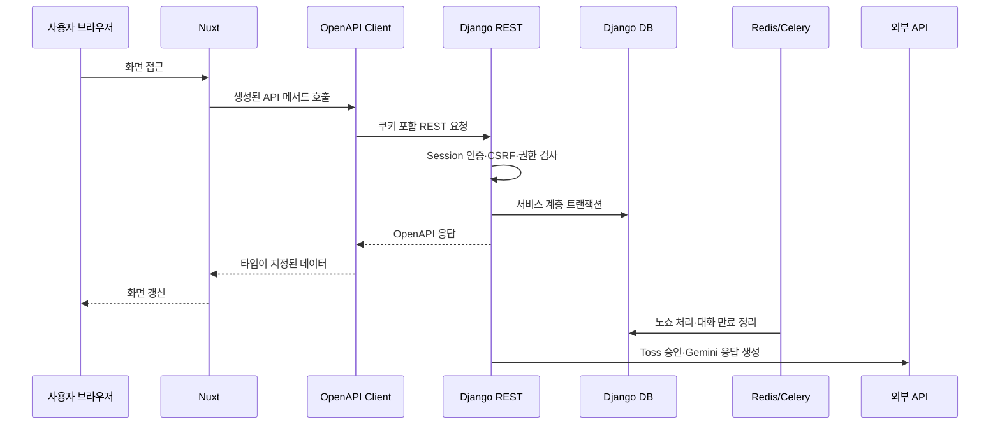

# Django 마이그레이션 구현 일지

> 기록 범위: 모노레포 기반 구축부터 로컬 Django REST 컷오버까지
>
> 현재 상태: 로컬 Nuxt 런타임의 Supabase 직접 의존 제거 완료, Neon 운영 데이터 컷오버 전

이 문서는 학슐랭을 Nuxt·Supabase 구조에서 Nuxt·Django 구조로 옮기며 실제로 구현한 내용과 검증 결과를 시간순으로 정리한다. 문제의 증상·원인·해결 과정은 [Django 마이그레이션 트러블슈팅 일지](./troubleshooting/django-migration.md)에 별도로 기록한다.

## 1. 작업 흐름과 PR

| 단계 | PR | 주요 결과 |
| --- | --- | --- |
| 모노레포 기반 | [#1](https://github.com/kangdy25/Hakchelin/pull/1) | Nuxt를 `frontend/`로 이동하고 Django·DRF·Celery·Redis·Caddy·CI 기반 구축 |
| Supabase 읽기 브리지 | [#2](https://github.com/kangdy25/Hakchelin/pull/2) | Supabase JWT 검증, legacy 읽기 adapter, 초기 OpenAPI 계약 구현 |
| Django 쓰기 서비스 | [#3](https://github.com/kangdy25/Hakchelin/pull/3) | 예약·취소·포인트·결제 서비스 계층과 트랜잭션 테스트 구현 |
| 트러블슈팅 문서화 | [#4](https://github.com/kangdy25/Hakchelin/pull/4) | 1~3단계의 빌드·인증·트랜잭션 문제 기록 |
| 프런트 읽기 연동 | [#5](https://github.com/kangdy25/Hakchelin/pull/5) | 메뉴·프로필·예약·거래 이력을 Django 생성 클라이언트로 우선 전환 |
| 로컬 Django REST 컷오버 | [#6](https://github.com/kangdy25/Hakchelin/pull/6) | 인증·읽기·쓰기·관리자·결제·챗봇·정기 작업을 Django로 전환하고 프런트 Supabase 런타임 제거 |

각 단계는 `codex/` 브랜치에서 한국어 Conventional Commit으로 작업했고, CI 통과 후 merge commit으로 병합했다.

## 2. 최종 로컬 요청 흐름

Nuxt 화면은 Django 내부 모델이나 데이터베이스를 알지 않는다. `useApi`가 UI 호환 타입을 유지하고, 실제 HTTP 요청은 `packages/api-client`의 생성 계약을 사용한다.

## 3. 백엔드 구현

### 인증과 권한

- CSRF 쿠키 발급, 이메일·비밀번호 회원가입, 로그인, 로그아웃, 현재 사용자 API를 구현했다.
- 인증 상태는 Django `sessionid` HttpOnly 쿠키로 유지한다.
- 모든 변경 요청은 `csrftoken`과 `X-CSRFToken`을 대조한다.
- 관리자 API는 사용자 `role`이 `admin`인지 서버에서 검사한다.
- 사용자 예약·거래·대화 조회는 항상 `request.user`로 범위를 제한한다.

### 메뉴와 예약

- 메뉴 공개 조회와 관리자 생성·수정·비활성화 API를 구현했다.
- 메뉴는 예약 이력을 보존하기 위해 삭제 대신 비활성화한다.
- 예약 시 가격·옵션·마감 시간·정원·동일 식사 시간 중복·포인트 잔액을 서버에서 검증한다.
- 예약 생성, 포인트 차감, 거래 이력 생성을 하나의 DB 트랜잭션으로 처리한다.
- 사용자 취소는 마감 시간에 따라 전액 또는 예약금 제외 환불을 적용한다.
- 관리자는 식권 사용과 전액 환불 취소를 처리할 수 있다.

### 포인트와 Toss 결제

- 포인트 기부, 관리자 포인트 조정, 충전 주문 생성과 승인 API를 구현했다.
- 충전 주문의 사용자 소유권과 승인 금액을 Toss 호출 전에 검증한다.
- Django 서버가 비밀 키로 Toss Payments 승인 API를 호출하므로 브라우저 응답만으로 포인트를 적립하지 않는다.
- 주문 ID를 Toss 멱등성 키로 사용하고 이미 승인된 주문은 포인트 거래를 다시 만들지 않는다.

### 챗봇과 백그라운드 작업

- 기존 `token`, `done`, `error` SSE 이벤트 계약을 유지했다.
- Gemini에는 현재 사용자의 포인트·예정 메뉴·최근 식권만 문맥으로 제공한다.
- 대화 이력과 AI 성공·실패 로그를 Django 모델에 저장한다.
- API 키가 없는 로컬 환경에서는 Django 연결 상태를 알려주는 안전한 fallback 응답을 사용한다.
- Celery Beat가 15분마다 노쇼를 처리하고, 1시간마다 7일이 지난 대화를 삭제한다.
- 노쇼는 식사 종료 1시간 뒤 예약금만 유지하고 나머지 금액을 거래 이력과 함께 환불한다.

## 4. 프런트엔드 구현

- `useAuth`를 Supabase Auth에서 Django 세션 인증으로 교체했다.
- `useDjangoApi`가 SSR 요청 쿠키 전달, 브라우저 credential, CSRF 헤더를 담당한다.
- 메뉴·예약·포인트·거래·사용자·관리자·챗봇 호출을 Django `/api/v1/`로 전환했다.
- SSE만 API 클라이언트 패키지의 전용 streaming 함수로 처리한다.
- `@nuxtjs/supabase`, Supabase CLI 패키지, 생성 DB 타입 파일을 제거했다.
- 프런트와 lockfile에서 `.from()`, `.rpc()`, Edge Function 호출을 제거했다.
- 개발 환경의 기본 API 주소를 `http://localhost:8000`으로 설정했다.

## 5. API 계약과 CI

- Django가 `/api/schema/`에서 OpenAPI 문서를 생성한다.
- 요청과 응답 serializer를 분리해 읽기 전용 필드가 쓰기 타입에 섞이지 않도록 했다.
- OpenAPI는 실행 중인 서버가 아닌 Django management command에서 생성한다.
- 생성된 TypeScript 타입은 `packages/api-client/src/schema.d.ts`에 커밋한다.
- CI는 다음 항목을 검사한다.

| 영역 | 검사 |
| --- | --- |
| Backend | Ruff, migration drift, Django 테스트 |
| API contract | OpenAPI 재생성 후 Git diff, API client 타입 검사 |
| Frontend | Nuxt 타입 검사, 프로덕션 빌드 |
| Preview | Vercel Preview 배포 |

## 6. 검증 결과

로컬 컷오버 PR에서 다음 결과를 확인했다.

- Django 테스트 12개 통과
- 로그인 CSRF 강제와 세션 쿠키 발급 검증
- 사용자별 예약·대화 격리와 관리자 권한 검증
- 예약·취소 잔액 및 거래 이력 원자성 검증
- Toss 승인 중복 요청의 멱등성 검증
- 노쇼 예약금 제외 환불 검증
- SSE `token → done` 순서와 대화 저장 검증
- 7일 경과 대화 삭제 검증
- OpenAPI 생성과 TypeScript API client 타입 검사 통과
- Nuxt 타입 검사와 프로덕션 빌드 통과
- Lightsail용 Django Docker 이미지 빌드 통과
- 실제 브라우저에서 회원가입 → 로그인 → SSR 프로필 → 메뉴·예약 조회 → 로그아웃 성공

## 7. 주요 트러블슈팅 요약

| 문제 | 원인 | 해결 |
| --- | --- | --- |
| 모노레포 전환 후 Vercel 빌드 실패 | Root Directory가 저장소 루트 | Vercel Root Directory를 `frontend`로 변경 |
| CI에서만 Nuxt 타입 검사 실패 | TypeScript·vue-tsc 버전이 직접 고정되지 않음 | 프런트 개발 의존성과 lockfile 고정 |
| 최종 URL 전환 후 legacy 테스트 실패 | 테스트가 Supabase adapter 구현에 결합 | 세션·권한·도메인 HTTP 계약 테스트로 교체 |
| 생성 클라이언트 요청 타입 오류 | APIView serializer 추론 실패와 읽기·쓰기 serializer 혼용 | `extend_schema`와 전용 write serializer 적용 |
| 로그인 다음 POST가 403 | 로그인 과정에서 CSRF 토큰 회전 | mutation마다 최신 CSRF 쿠키를 헤더에 반영 |
| 예약 API에서 500 | `request.user`가 `SimpleLazyObject` | 서비스에서 `get_user_model()`로 잠금 조회 |
| 브라우저에서 `Failed to fetch` | `localhost`와 `127.0.0.1` origin 혼용 | 개발 host 통일, 양쪽 CORS·CSRF origin 명시 |
| 결제·노쇼 책임 공백 | Edge Function·pg_cron 제거 후 대체 경로 필요 | Toss gateway와 Celery Beat 작업 구현 |

자세한 진단 과정과 배운 점은 [트러블슈팅 일지](./troubleshooting/django-migration.md)를 참고한다.

## 8. 아직 남은 작업

로컬 API 전환은 완료됐지만 운영 마이그레이션은 아직 끝나지 않았다.

1. Neon에 최종 Django migration을 적용하고 idempotent ETL을 작성한다.
2. 사용자 UUID, 포인트 합계, 예약·거래·AI 데이터 수량을 자동 대조한다.
3. PostgreSQL 환경에서 동시 예약·정원 초과·행 잠금 통합 테스트를 실행한다.
4. 기존 Supabase Auth 사용자는 unusable password로 이관하고 Resend 재설정 메일을 발송한다.
5. 운영 도메인에서 Secure 쿠키, CORS, CSRF, Caddy TLS를 검증한다.
6. 실제 Toss·Gemini staging 키로 승인 실패·타임아웃·SSE 오류 경로를 검증한다.
7. DB 백업 생성과 복원 리허설 뒤 운영 컷오버를 진행한다.

Supabase SQL과 Edge Function 파일은 이 단계가 끝날 때까지 ETL 원본과 복구 대조 자료로 보존한다.
